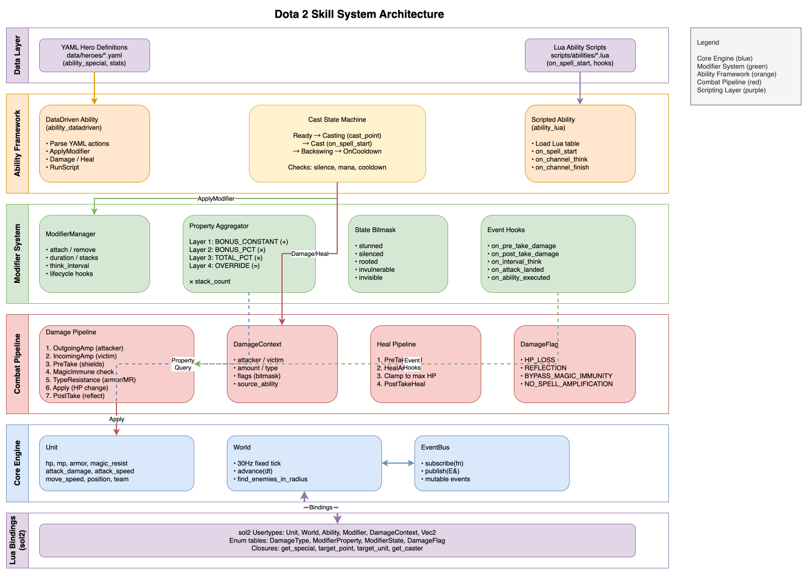

# Dota 2 Skill System

A production-quality Dota 2–style ability and modifier system implemented in C++20 with Lua scripting (sol2) and YAML data definitions (yaml-cpp). Features a complete combat pipeline, property aggregation system, and event-driven architecture.



## Features

- **Two ability flavors**: DataDriven (pure YAML) and Scripted (Lua hooks)
- **Three-part modifier model**: Property aggregation, state bitmask, event hooks
- **Staged combat pipelines**: 7-stage damage pipeline, 4-stage heal pipeline
- **Event-driven core**: 30Hz fixed-tick World with publish/subscribe EventBus
- **Full Lua integration**: sol2 bindings for all core types and enums
- **Three playable heroes**: Lion, Lina, Juggernaut with 12 unique abilities
- **91 passing tests**: Comprehensive test coverage with GoogleTest

## Quick Start

```sh
cmake -B build
cmake --build build -j
ctest --test-dir build --output-on-failure    # run all 91 tests
./build/duel                                   # 2v1 team-fight demo
```

Requires a C++20 compiler (AppleClang 15+, Clang 15+, GCC 12+, MSVC 19.30+). All dependencies (GoogleTest, yaml-cpp, Lua 5.4, sol2) are fetched automatically via [CPM.cmake](cmake/CPM.cmake) on first configure.

## Architecture

### Layers

| Layer | Location | Responsibility |
|-------|----------|----------------|
| **Data** | `data/heroes/*.yaml` | Hero stats, ability definitions with per-level values |
| **Scripts** | `scripts/abilities/*.lua` | Lua ability implementations with lifecycle hooks |
| **Ability Framework** | `include/dota/ability/`, `src/ability/` | Cast state machine, DataDriven (YAML) + Scripted (Lua) |
| **Modifier System** | `include/dota/modifier/`, `src/modifier/` | Property aggregation (4 layers), state bitmask, event hooks |
| **Combat Pipeline** | `include/dota/combat/`, `src/combat/` | Staged damage/heal with modifier intervention |
| **Core Engine** | `include/dota/core/`, `src/core/` | Unit, World (30Hz tick), EventBus |
| **Lua Bindings** | `src/script/` | sol2 usertypes for Unit/World/Vec2, enum tables |

### Key Design Patterns

#### Ability System

- **DataDriven** (`ability_datadriven`): Pure YAML action lists (ApplyModifier, Damage, Heal, RunScript)
- **Scripted** (`ability_lua`): Lua table with `on_spell_start`, `on_channel_think`, `on_channel_finish` hooks
- **Cast lifecycle**: Ready → Casting (cast_point) → fires `on_spell_start` → Backswing → OnCooldown
- **Legality checks**: silence, cooldown, mana, target validity, magic immunity

#### Modifier System

- **Properties**: Numeric bonuses aggregated in 4 layers (BONUS_CONSTANT → BONUS_PCT → TOTAL_PCT → OVERRIDE)
- **States**: Bitmask (stunned, silenced, rooted, invulnerable, invisible)
- **Events**: Hooks like `on_pre_take_damage`, `on_interval_think`, `on_attack_landed`
- Property values multiply by `stack_count` for stacking modifiers

#### Combat Pipelines

- **Damage**: OutgoingAmp → IncomingAmp → PreTake (shields) → MagicImmune check → TypeResistance → Apply → PostTake (reflect)
- **Heal**: PreTakeHeal → HealAmpPct → clamp to max HP → PostTakeHeal
- **DamageFlag bitmask**: HP_LOSS, REFLECTION, BYPASS_MAGIC_IMMUNITY, NO_SPELL_AMPLIFICATION

#### Lua Integration

- ScriptedAbility self-table with closures: `get_special`, `target_point`, `target_unit`, `level`, `get_caster`
- Full bindings for Unit, World, Ability, Modifier, DamageContext, Vec2
- Enum tables for DamageType, ModifierProperty, ModifierState, DamageFlag

## Project Structure

```text
dota2_skill/
├── include/dota/          # Public headers
│   ├── core/              # Unit, World, EventBus, Vec2
│   ├── modifier/          # Modifier, ModifierManager, enums, library
│   ├── ability/           # Ability, DataDriven, Scripted
│   └── combat/            # Damage/heal pipelines, DamageContext
├── src/                   # Implementation
│   ├── core/              # Core engine implementation
│   ├── modifier/          # Modifier system + generic modifiers
│   ├── ability/           # Ability framework + YAML loader
│   ├── combat/            # Combat pipeline implementation
│   └── script/            # Lua bindings (sol2)
├── data/heroes/           # YAML hero definitions
│   ├── lion.yaml          # Lion (all DataDriven)
│   ├── lina.yaml          # Lina (YAML + Lua passive)
│   └── juggernaut.yaml    # Juggernaut (Lua-heavy)
├── scripts/abilities/     # Lua ability implementations
├── tests/                 # GoogleTest suites
│   ├── test_event_bus.cpp
│   ├── test_unit_basic.cpp
│   ├── test_modifier_*.cpp
│   ├── test_ability_*.cpp
│   ├── test_lua_*.cpp
│   ├── test_damage_pipeline.cpp
│   ├── test_hero_*.cpp    # Per-hero integration tests
│   └── test_three_hero_kit.cpp
└── examples/
    └── duel.cpp           # 2v1 team-fight demo
```

## Adding a New Hero

1. **Create hero definition**: `data/heroes/<name>.yaml`

   ```yaml
   hero_name: hero_example
   base_health: 600
   base_mana: 300
   abilities:
     - ability_example_q
     - ability_example_w
   ```

2. **For DataDriven abilities**: Define actions in YAML

   ```yaml
   ability_example_q:
     base_class: ability_datadriven
     ability_behavior: UNIT_TARGET
     on_spell_start:
       - action: Damage
         target: TARGET
         damage: "%damage"
   ```

3. **For Scripted abilities**: Create `scripts/abilities/<ability_name>.lua`

   ```lua
   return {
     on_spell_start = function(self)
       local caster = self:get_caster()
       local damage = self:get_special("damage")
       -- implementation
     end
   }
   ```

4. **Add integration tests**: `tests/test_hero_<name>.cpp`

   ```cpp
   TEST(HeroExampleTest, AbilityQ_DamagesTarget) {
     // test implementation
   }
   ```

5. **Register in CMakeLists.txt**: Add test file to `add_executable(dota_tests ...)`

## Adding a New Modifier Property

1. Add enum entry in [include/dota/modifier/enums.hpp](include/dota/modifier/enums.hpp):

   ```cpp
   enum class ModifierProperty {
     // ...
     MyNewProperty,
   };
   ```

2. Map its aggregation layer in `layer_of()` (same file)

3. Route it through Unit stat getter in [src/core/unit.cpp](src/core/unit.cpp)

4. Expose to Lua in [src/script/bindings.cpp](src/script/bindings.cpp) → `property_table()`

## Running Tests

```sh
# All tests (91 total)
ctest --test-dir build --output-on-failure

# Specific test suite
ctest --test-dir build -R "HeroLionTest"

# Verbose output
ctest --test-dir build -V

# Run tests in parallel
ctest --test-dir build -j8
```

## Examples

### DataDriven Ability (Lion Earth Spike)

```yaml
lion_earth_spike:
  base_class: ability_datadriven
  ability_behavior: UNIT_TARGET
  ability_target_team: ENEMY
  ability_target_type: HERO | BASIC
  cast_point: 0.3
  cast_range: 600
  cooldown: 12.0
  mana_cost: 100
  ability_special:
    damage: [100, 175, 250, 325]
    stun_duration: [1.0, 1.5, 2.0, 2.5]
  on_spell_start:
    - action: Damage
      target: TARGET
      damage: "%damage"
      damage_type: MAGICAL
    - action: ApplyModifier
      target: TARGET
      modifier: modifier_stunned
      duration: "%stun_duration"
```

### Scripted Ability (Juggernaut Blade Fury)

```lua
return {
  on_spell_start = function(self)
    local caster = self:get_caster()
    caster:apply_modifier("modifier_juggernaut_blade_fury", self:get_special("duration"), caster, self)
  end,
  
  on_channel_think = function(self)
    local caster = self:get_caster()
    local radius = self:get_special("radius")
    local damage = self:get_special("damage_per_tick")
    
    local enemies = caster:get_world():find_enemies_in_radius(caster:position(), radius, caster:team())
    for _, enemy in ipairs(enemies) do
      caster:deal_damage(enemy, damage, DamageType.MAGICAL, self)
    end
  end
}
```

### Custom Modifier (Lina Fiery Soul)

```lua
return {
  declared_properties = function(self)
    return {
      [ModifierProperty.AttackSpeedBonus] = self:get_special("attack_speed_bonus"),
      [ModifierProperty.MoveSpeedBonus] = self:get_special("move_speed_bonus")
    }
  end,
  
  on_ability_executed = function(self, event)
    if event.ability:owner() == self:parent() then
      self:increment_stack_count()
      self:refresh_duration()
    end
  end
}
```

## Compile-Time Defines

- `DOTA_SCRIPT_DIR`: Absolute path to `scripts/` (set on `dota_core` target)
- `DOTA_DATA_DIR`: Absolute path to `data/` (set on test and duel targets)

## Editor Setup

The CMake project exports `build/compile_commands.json` for C++ language servers and IDE code navigation. After running `cmake -B build`, VS Code's Microsoft C/C++ extension will use the workspace settings in [.vscode/settings.json](.vscode/settings.json).

If code navigation looks stale, reset the IntelliSense database:

```sh
# VS Code command palette:
# C/C++: Reset IntelliSense Database
# Developer: Reload Window
```

## Implementation Status

All 6 stages complete (91/91 tests passing):

- ✅ **Stage 1**: Scaffolding + Core Entities + Event Bus
- ✅ **Stage 2**: Modifier System
- ✅ **Stage 3**: Ability Framework + DataDriven (YAML) Loader
- ✅ **Stage 4**: Lua Integration
- ✅ **Stage 5**: Damage / Heal Pipeline
- ✅ **Stage 6**: Three Heroes + CLI Duel Demo

See [IMPLEMENTATION_PLAN.md](IMPLEMENTATION_PLAN.md) for detailed stage breakdown (removed after completion).

## License

MIT
